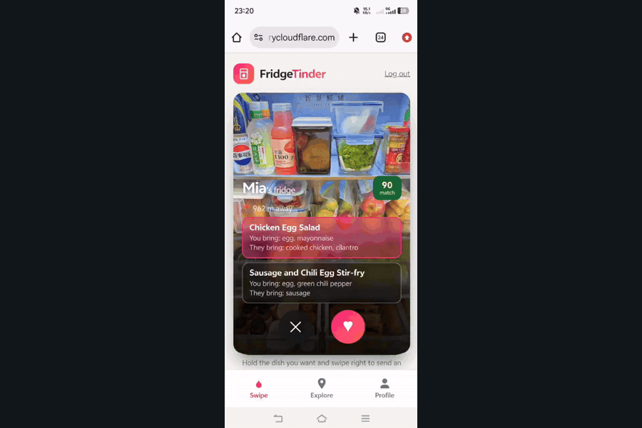
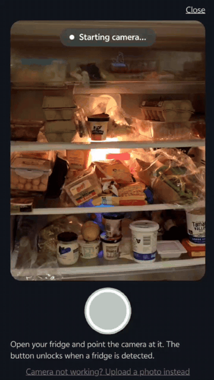

# FridgeTinder

**It's a match! Your fridge and a neighbour's fridge just swiped right on each other.**

<p>
  
  
</p>

FridgeTinder is Tinder for fridges: scan your fridge with your camera, AI reads the ingredients, finds nearby fridges whose contents *combine* with yours into real dishes, and sends an anonymous AI-written invite to cook together - before the food goes to waste.

Built for **SYNCS HACK 2026** - theme: *Blocks that make up the world*. Ingredients are blocks: alone they sit and expire, combined across two fridges they become a meal and a new connection between neighbours.

## How it works

1. **Log in** (Email + password; first login creates your account) - you join the match pool.
2. **Profile tab**: point your camera at your open fridge. A live indicator turns green ("Fridge detected") only when AI confirms the camera is actually aimed at a fridge interior - only then does the shutter unlock. After the shot, AI extracts every visible ingredient; you confirm/edit the list. Drop a pin for your location. Both are required to unlock matching.
3. **Swipe tab**: matched fridges as a Tinder-style deck - each card shows a neighbour's fridge and up to 2 dishes you could cook *together*. Hold a dish and swipe right to send an anonymous invite; swipe left to pass.
4. **Explore tab**: the same matches on a map. AI proposes real dishes that use ingredients from *both* fridges, with a match score (rubric-anchored, reproducible) and what each side brings. Pick dishes and send an anonymous invite - the email is AI-written and relayed by the platform.
5. **Invites**: recipients see the invite in their Profile inbox (real users also get the email). When they hit **Accept**, and only then, both sides see each other's contact - emails stay private until mutual consent. Demo seed users auto-accept after ~25 s so the full loop can be shown live.

## Tech

- **Frontend**: vanilla JS + Leaflet (OpenStreetMap), no build step. Live camera via `getUserMedia`.
- **Backend**: Node.js + Express, JSON file storage.
- **AI**: Google Gemini multimodal - fridge-interior gate (`prompts/detect.txt`), ingredient extraction with uncertainty separation (`prompts/extract.txt`), cross-fridge dish matching with a strict scoring rubric (`prompts/match.txt`), invite writing (`prompts/email.txt`). Temperature 0 for reproducible results. No model training required.
- **Email**: Nodemailer relay (optional; previews shown in-app when SMTP is not configured).

## Quick start

Requires **Node.js 18+** (https://nodejs.org).

```bash
git clone https://github.com/YangChong-lol/syncs-hack-2026.git
cd syncs-hack-2026
npm install
copy .env.example .env    # Windows (use `cp` on macOS/Linux), then put your GEMINI_API_KEY inside
npm start                 # open http://localhost:3000
```

Then the 30-second tour:

1. Log in with **any email + password** - first login creates the account.
2. Go to **Profile**, scan a fridge (or use "Upload a photo instead" - any photo from `public/seed-fridges/` works).
3. **Drop your location pin in Camperdown, Sydney** - that's where all 11 seed neighbours live; pin anywhere else and you'll match with no one.
4. Open **Swipe**, hold a dish, swipe right. Check Profile ~25 s later: the neighbour has accepted and you've exchanged contacts.
5. Even better with friends: grab a few people and register together (same server, pins near each other). Everyone who scans a fridge joins the match pool for real - you'll show up in each other's swipe decks, invites land in each other's inboxes, and accepting exchanges contacts. Nothing is simulated between real users.

Notes:

- **We strongly recommend trying it on a phone** - the live camera gate (red -> green "Fridge detected") is the heart of the app. The camera API needs HTTPS, so expose the server through a tunnel and open the printed URL on your phone:

```bash
cloudflared tunnel --url http://localhost:3000   # or: npx localtunnel --port 3000
```

- Get a Gemini key: https://aistudio.google.com/apikey (models used: `gemini-3.6-flash` + `gemini-3.5-flash-lite`, configurable in `.env`).
- **No key? It still runs** in demo mode with canned detection/extraction and a rule-based matcher, so the full flow is clickable.
- **Emails**: without SMTP settings in `.env`, invites are in-app + preview only. Fill `SMTP_HOST/SMTP_USER/SMTP_PASS` (e.g. Gmail app password) to really send.

### Useful commands

```bash
node scripts/test-match-invite.js   # E2E test: auth -> profile -> match -> invite -> auto-accept
node scripts/test-real-api.js public/seed-fridges/fridge03.jpg   # vision smoke test
npm run seed                        # re-extract seed inventories with your API key
```

To reset the demo to a clean state, stop the server and delete `data/users.json` and `data/invites.json` - seed users regenerate on next start.

## Seed data

`data/users.seed.json` contains 11 fictional neighbours spread around **Camperdown, Sydney**. Their fridge photos are in `public/seed-fridges/`, and their ingredient lists were produced by **real vision-model recognition of those exact photos** (conservative: uncertain items are listed separately, nothing invented). To re-run the extraction with your own API key:

```bash
npm run seed
```

## Project structure

```
server.js            Express app + API routes (auth, invites, matching)
lib/gemini.js        Gemini calls + demo-mode fallbacks
lib/store.js         JSON user store, auth, invites, geo search
lib/mailer.js        anonymous email relay
prompts/             all LLM prompts (the real "source code" of the AI)
public/index.html    login page (email + password)
public/app.html      main app: Swipe / Explore / Profile tabs
public/js/login.js   login / first-login-registers flow
public/js/app.js     app shell + FTApp interface (shared match cache, invites)
public/js/swipe.js   Tinder-style deck: hold a dish, swipe right to invite
public/js/explore.js map of matched fridges + invite modal
public/js/profile.js fridge scan, location, invite inbox/outbox
public/seed-fridges/ seed users' fridge photos
data/users.seed.json seed users (real recognition results)
scripts/             seed extraction + E2E test scripts
```

## Credits / third-party

- [Leaflet](https://leafletjs.com/) + [OpenStreetMap](https://www.openstreetmap.org/) tiles
- [Google Gemini API](https://ai.google.dev/)
- [Express](https://expressjs.com/), [Nodemailer](https://nodemailer.com/), [dotenv](https://github.com/motdotla/dotenv)
- Seed fridge photos: public posts on Xiaohongshu (小红书), used for demo purposes only (original poster IDs visible in watermarks)

## Team

- Yang Chong - Designer, programmer
- Ruihan Zhao - Designer, UI programmer
- Cursor Agent - The Workhorse
